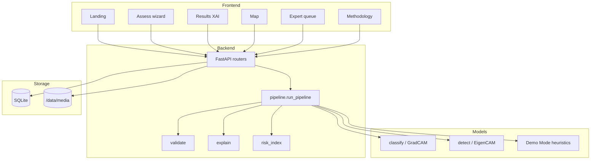

# Architecture

```mermaid
flowchart TB
  subgraph Frontend
    L[Landing]
    A[Assess wizard]
    R[Results XAI]
    M[Map]
    Q[Expert queue]
    Meth[Methodology]
  end

  subgraph Backend
    API[FastAPI routers]
    Pipe[pipeline.run_pipeline]
    Val[validate]
    Expl[explain]
    Risk[risk_index]
  end

  subgraph Models
    C[classify / GradCAM]
    D[detect / EigenCAM]
    Demo[Demo Mode heuristics]
  end

  subgraph Storage
    DB[(SQLite)]
    Media[(/data/media)]
  end

  L --> API
  A --> API
  R --> API
  M --> API
  Q --> API
  Meth --> API
  API --> Pipe
  Pipe --> Val
  Pipe --> C
  Pipe --> D
  Pipe --> Demo
  Pipe --> Expl
  Pipe --> Risk
  API --> DB
  API --> Media
```